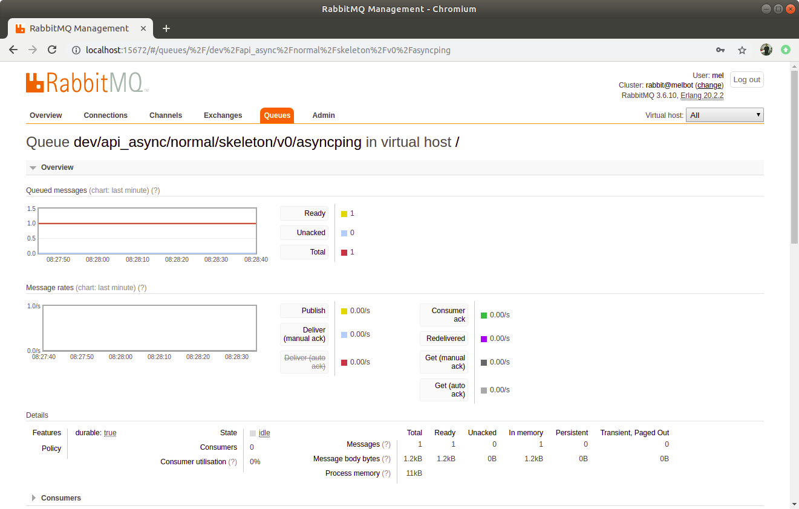

# Set up workers to consume messages

This section will describe how we can consume messages and user Supervisor to control these consumers. 

Included in the Framework Bundle is a Symfony Command that is for consuming message from a queue:

``` 
/vendor/smartbox/integration-framework-bundle/Command/ConsumeCommand.php
```

An example of this command being used would be as follows: 

```
php app/console smartesb:consumer:start queue://api/normal/skeleton/v0/asyncping --killAfter=200

```
or the follow for our dev environment

```

php app/dev_console smartesb:consumer:start queue://api/normal/skeleton/v0/asyncping --killAfter=200

```


The queue ``` queue://api/normal/skeleton/v0/asyncping``` is where the Command will try to consume from. 
The option ``` --killAfter=200 ``` tells the command to stop running after it has processed 200 messages. 

The queue mnetioned above will be mapped to the route ``` api://execute/skeleton/v0/asyncping``` that is the "from" part of the flow defined in ```app/config/flows/AsyncPing.xml```:

```xml

<?xml version="1.0" encoding="UTF-8"?>
<beans xmlns="http://www.springframework.org/schema/beans" xmlns:xsi="http://www.w3.org/2001/XMLSchema-instance" xmlns:camel="http://camel.apache.org/schema/spring" xsi:schemaLocation="http://www.springframework.org/schema/beans http://www.springframework.org/schema/beans/spring-beans.xsd http://camel.apache.org/schema/spring http://camel.apache.org/schema/spring/camel-spring.xsd">

    <camelContext trace="false" xmlns="http://camel.apache.org/schema/spring">
        <route>
            <from uri="api://execute/skeleton/v0/asyncping"/>
            <to uri="rest://remote_system_api/sendPingMessage" />
        </route>
    </camelContext>
</beans>
``` 


The mapping of ``` queue://api/normal/skeleton/v0/asyncping``` to ``` api://execute/skeleton/v0/asyncping``` happens in another flow definition: ``` app/config/flows/apiAsync.xml```

```xml
<?xml version="1.0" encoding="UTF-8"?>
<beans xmlns="http://www.springframework.org/schema/beans"
       xmlns:camel="http://camel.apache.org/schema/spring"
       xmlns:xsi="http://www.w3.org/2001/XMLSchema-instance"
       xsi:schemaLocation="http://www.springframework.org/schema/beans http://www.springframework.org/schema/beans/spring-beans-3.0.xsd
       http://camel.apache.org/schema/spring http://camel.apache.org/schema/spring/camel-spring.xsd">

    <camelContext trace="false" xmlns="http://camel.apache.org/schema/spring">
        <route>
            <from uri="queue://api/{priority}/{apiService}/{apiVersion}/{apiMethod}" customId="true" id="read_api_queue">
                <description/>
            </from>
            <to uri="api://execute/{apiService}/{apiVersion}/{apiMethod}" customId="true" id="execute_api_method_async">
                <description>Main API endpoint</description>
            </to>
            <!-- Note that we are not handling callbacks here in the skeleton bundle. -->
            <stop customId="true" id="null_callback_end"/>
        </route>
    </camelContext>

</beans>
```

When a message is consumed, the consume Command will look at its Itinerary and decide what it should do with the message. 
Here are the contents of a ping message that was sent to RabbitMq:

```json
{
  "_type": "Smartbox\\Integration\\FrameworkBundle\\Components\\Queues\\QueueMessage",
  "body": {
    "_type": "Smartbox\\Integration\\FrameworkBundle\\Core\\Messages\\Message",
    "body": {
      "_type": "SmartboxSkeletonBundle\\Entity\\PingMessage",
      "message": "Ping",
      "timestamp": "1541492371"
    },
    "context": {
      "values": {
        "_type": "Smartbox\\CoreBundle\\Type\\SerializableArray",
        "array": {
          "api_mode": {
            "_type": "Smartbox\\CoreBundle\\Type\\StringType",
            "value": "real"
          },
          "from": {
            "_type": "Smartbox\\CoreBundle\\Type\\StringType",
            "value": "api://entry/skeleton/v0/asyncping"
          },
          "priority": {
            "_type": "Smartbox\\CoreBundle\\Type\\StringType",
            "value": "normal"
          },
          "transaction_id": {
            "_type": "Smartbox\\CoreBundle\\Type\\StringType",
            "value": "5be14e93ba7bb2.45350727"
          },
          "version": {
            "_type": "Smartbox\\CoreBundle\\Type\\StringType",
            "value": "0"
          }
        }
      }
    },
    "headers": {
      "api_mode": "real",
      "async": "true",
      "from": "api://entry/skeleton/v0/asyncping"
    }
  },
  "context": {
    "values": {
      "_type": "Smartbox\\CoreBundle\\Type\\SerializableArray",
      "array": {}
    }
  },
  "headers": {
    "destination": "dev/api_async/normal/skeleton/v0/asyncping",
    "expiration": "86400000",
    "expires": "1541578771000",
    "from": "queue://api/normal/skeleton/v0/asyncping",
    "priority": "4",
    "ttl": "86400"
  }
}
```
Note that the "destination" matches the queue that we have sent this to in RabbitMq:




Also worth noting is the body that is sent, it is a serialized representation of our Entity ``` SmartboxSkeletonBundle\\Entity\\PingMessage```.


In practice we advise that you use the "killAfter" option so that consumers will exit after processing a certain amount of message. 
In conjunction with this we also recommend that you have process control system like [Supervisord](http://supervisord.org/) to rerun the consumer.

To install supervisor on Ubuntu use the following: 
```bash
sudo apt-get install supervisor
```

To create a consumer that will be controlled by supervisord, we can add a .conf file to the supervisor configurations directory. For example:
 ``` /etc/supervisor/conf.d/SuperHardWorker.conf```

 which would contain contents as follows:

 ```bash
[program:consumer_db_queue]
process_name = %(program_name)s_%(process_num)02d
autostart = true
autorestart = true
numprocs=10
directory=/var/www/skeleton/
command = php app/console smartesb:consumer:start queue://api/normal/skeleton/v0/asyncping --killAfter=200
stdout_logfile = /home/mel/stdout.log
stderr_logfile = /home/mel/stderr.log
startretries = 10
user = mel
 ```
Note that the value ```numprocs=10``` means that supervisor will attempt to always run 10 instances/processes of the program.
